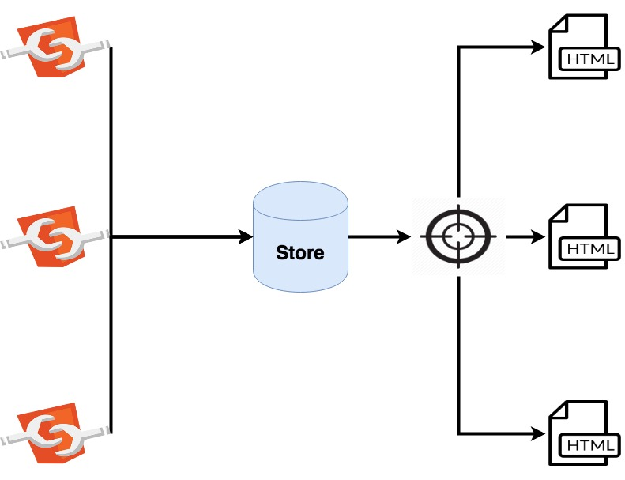

# Introduction to Redux

The objective of this documentation is to learn what is the architecture redux and what advantages and disadvantages have the projects
that implements it.

## The two way data binding problem

To understand Redux is important to understand what problem it tries to solve. Look at the next Angular example:

https://stackblitz.com/edit/two-data-bind-fail?file=src%2Fapp%2Fapp.component.html

Let's check what happen in that example:

 The component has a variable named "name" which get a value when the instance of the object is created. However, as soon as the view of the component is rendered, the method "changeName" is executed and the value of "name" changes from the template. 

 As you probably know, Angular implements a "two-ways-data-binding" model. It means that the information can come from two side at the same time; from the object to the view and from the view to the object. 

 

 It is great in order to add logic in the templates which update the data as a consequence of the user interactions but, at the same time, it brings other problem like to decide what it the right value of a variable if it is modify at the same time by the template and the component.

Returning on our previus example, if we check the browser console, we'll se that there is the next error:
```
ERROR
Error: ExpressionChangedAfterItHasBeenCheckedError: Expression has changed after it was checked. Previous value: 'name: Angular'. Current value: 'name: JavaScript'.
```
What it says, basically is that the variable name is getting two different values at the end of the component's life cicle; one from the object and other from the view. The app has choosed the one from the view because it is the last value recived but it can not be completely sure if it is the expected result. The reson is easy, both values are given with no user interaction so the app can not decide which is the real source of true.

## The state

The state of a view is the set of dinamic values that a view has in a specific time. In our previus example, the only dinamic value that the view has is the variable "name" but, usually, the views are composed by several dinamic values.

As we saw, in a two way data binding model, the state of the view can be updated from the template and from the component however, this feature can be counterproductive becasue the posibility that both source updates the state at the same time with different values so we have to decide which of the two directions we should ban. As all web gets the data from the back by services and the component object is the one which can inject these service, it has sense that the onle way to update the state of the view is from the object. So, from now on, the view will be a read-only element that collects the values of the state and updates according to them.


The next question is if a state at the same level that a component is enough for the app. Let's think a bit in a search web page. In a very few ocassions, the user finds the information obtained from a search web useful. Usually he/ she choose one of the results to go at a details web page where it is possible to check all the information about the row clicked. It is obious that the search and details web pages are linked. The state of the search page gets the information that the details web page should display. If we keep a state per component, we should do two request to the back: one to get the results of the search and other to get the information of the element selected. However if we keep an only one state for the whole app the details web page onle has to read the information that the search web page has obtained in the first request. It will improve the user experience because it will reduce the waiting time and, also, it will reduce the number of resources consumed in the back. So it seems clear that we should go by a global state which store all the state for all the views in the app. This kind of object will be called store.

Ok so let's review or current situation: we have a global object called store which has the state for all the view in our app... the question now is how to organize the information. I mean... imagine a sell car company app. It should have information about cars, clients, comercial,... All these information should be stored in the same object but for sure we won't need to reatreave all the information of the app always. For example, in a web page where we render the details of a car we don't need the information of the client. 

Well, the thing is that this problem has a easy solution. Our store is a JS object so we can treat it as a small no sql data base. The store can have attributes in the root level for each kind of data that we need for the app:

```
{
    cars: [{...}, {...}, {...}],
    clients: {...}, {...}, {...}],
    comercials: {...}, {...}, {...}]
}
```
To reatreave information we can create selectors. A selector is a function that returns a part of the state:

```
funciton carsSelector (state) {
    return state.cars;
}
```
We can even define queries to do on store... as I said, like a no sql data base:

```
//Selector to find a car by id in the state
function carSelector (state, cardId) {
    return state.cars.find((car) => car.id === cardId)[0];
}
```
Sumarizing, we have a global app state which is updated by all the components and read it by all the views. Each veiw gets the information that it needs by the selectors that are functions to get a piece of the global state from the store.

